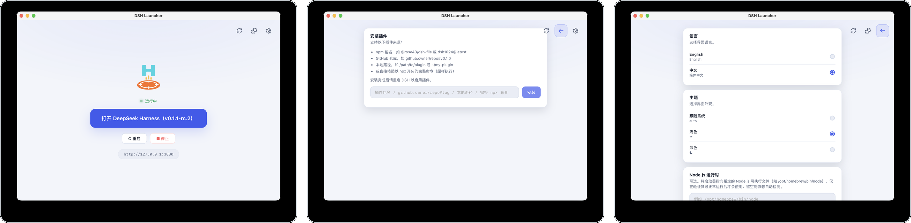

# DSH Launcher

> **DeepSeek Harness 一键安装启动器** —— 不用装 Node.js，不用敲命令行，双击即用。

一次安装，双击启动，直接在浏览器里使用 DeepSeek Harness。

---

## ✨ 功能

- **一键安装**：自动下载 Node.js（SHA-256 校验）和 DeepSeek Harness，零配置
- **一键启动**：首页一个按钮，未安装就安装，已安装就打开
- **自动更新**：检测到 npm 有新版本时，一键更新
- **系统托盘**：关闭窗口藏到托盘，DSH 继续后台运行（打开 / 重启 / 停止 / 退出）
- **双语主题**：中文 / English，浅色 / 深色 / 跟随系统
- **开机自启**：可选登录时自动启动 DSH

---

## 🖥️ 界面预览



---

## 🚀 快速开始

### 下载

从 [Releases](https://github.com/ConvFusion/DSH-Launcher/releases) 下载最新版本：

- **macOS**：`.dmg`（支持 Apple Silicon 和 Intel）
- **Windows**：`.exe` 安装包

### 安装使用

1. 打开安装包，将 **DSH Launcher** 拖到应用程序（macOS）或运行安装向导（Windows）
2. 启动 **DSH Launcher**
3. 首次使用点击 **「安装 DeepSeek Harness」**，等待下载完成
4. 点击 **「打开 DeepSeek Harness」**，自动在浏览器中打开
5. 关闭窗口 → 隐藏到系统托盘，DSH 继续运行

---

## ⚠️ macOS 「文件已损坏」/「无法打开」解决方法

由于应用可能未经过 Apple 公证，首次打开时可能提示「文件已损坏」或「无法打开，因为无法验证开发者」。请按以下步骤操作：

### 方法一：右键打开（推荐）

1. 在「应用程序」中找到 **DSH Launcher**
2. **右键（或按住 Control 键点击）** 应用图标
3. 选择 **「打开」**
4. 在弹出的对话框中再次点击 **「打开」**

### 方法二：在系统设置中允许

1. 尝试打开一次 DSH Launcher（会弹出错误提示）
2. 打开 **系统设置** → **隐私与安全性**
3. 滚动到底部，看到「已阻止使用 "DSH Launcher"」，点击 **「仍要打开」**
4. 再次打开应用即可

### 方法三：终端命令

如果以上方法仍不行，打开「终端」执行：

```bash
xattr -cr "/Applications/DSH Launcher.app"
```

执行完成后再正常打开应用即可。

---

## 📂 数据目录

所有文件都存放在 `~/.dsh-launcher/` 下，不修改系统环境：

```
~/.dsh-launcher/
├── config.json      # 设置（语言、主题、端口等）
├── logs/
│   ├── launcher.log # 启动器日志
│   └── harness.log  # DSH 运行日志
├── runtime/         # Node.js 运行时（按需下载）
└── dsh/             # DeepSeek Harness 安装目录
```

---

## 📝 License

Apache-2.0
